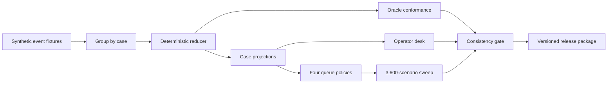

# Coinbase Finance Operations — project design

**Status:** release-candidate local synthetic build, started 2026-09-20 and validated 2026-09-22. It includes a fixture corpus, deterministic reducer, SQLite event store, four-policy experiment, 3,600-scenario sensitivity sweep, interactive operator report, and automated consistency checks. It does not include live payments, deployment, or external usability results.

This project designs a simulated exception desk for a fictional institutional-data seller using fixed-price x402 `exact` payments on Base. It asks one operational question:

> When settlement evidence and delivery evidence disagree, which cases should an operator handle first, and what evidence makes retry, recovery, refund, or closure safe?

The selected design is an append-only event ledger plus a deterministic state reducer and a controlled comparison of FIFO, deadline-first, value-first, and hybrid exception queues. The current decision retains FIFO because the predeclared replacement gate did not pass. The model keeps `timeout` distinct from `failed`, payment distinct from delivery, and refund approval distinct from refund settlement. See [the decision brief](01-brief/decision.md), [design comparison](03-design/alternatives.md), [technical design](03-design/system-design.md), and [first milestone](06-execution/first-build.md).

## Architecture



The event log is the evidence boundary. Projections, reconciliation, operator guidance, and policy experiments are derived views that can be regenerated and checked against the independently authored oracle.

## Key result

| Result | Meaning |
|---|---|
| FIFO and deadline-first each produced 6 overdue cases | The proposed replacement failed its predeclared 15% improvement gate. |
| Value-first and hybrid each produced 4 overdue cases in the initial workload | Promising sensitivity signal, not a production recommendation. |
| All four policies had zero modeled control failures | The comparison preserved the declared action constraints. |
| 3,600 seeded scenarios completed | Results are distributions across assumptions, not a claim of universal superiority. |

## Portfolio position and boundaries


The first build is local and entirely synthetic. It does not use a wallet, sign requests, call a facilitator, broadcast transactions, create accounts, install dependencies, or move money. Live Base Sepolia interoperability is an optional later gate, not part of this plan.

## Build and verify the complete release

Python 3.9+ is sufficient; there are no third-party dependencies.

```sh
python3 scripts/release.py
```

That single command runs the complete test suite, regenerates the deterministic outputs, runs the cross-artifact gate, verifies PDF/workbook/video hashes, and rebuilds the ZIP with a SHA-256 checksum. GitHub Actions runs the same command on pushes and pull requests.

For development, the individual commands remain available:

```sh
PYTHONPATH=src python3 -m unittest discover -s tests -v
PYTHONPATH=src python3 -m exception_desk.cli --root .
```

Generated files are written to `artifacts/generated/`. The initial scenario run produced the same overdue-case count under FIFO and deadline-first, so it **does not pass the 15% improvement gate** and does not support adopting the proposed policy yet. The result is useful precisely because the baseline is allowed to win.

The reviewer package is in `artifacts/`: decision memo, canonical state model, fixture corpus and oracle, reconciliation workbook, four-policy results, 3,600-scenario sensitivity summary, interactive operator desk, consistency audit, runbook, validation report, narrated demo, and reviewer protocol. See the [release-readiness record](05-validation/release-readiness.md) for the latest automated evidence and remaining human gates.

## Package map

| Folder | Purpose |
|---|---|
| `01-brief` | decision, audience, scope, success criteria |
| `02-research` | dated source register, data feasibility, and archived prior plans with local paths removed |
| `03-design` | alternatives, state/data model, architecture and controls |
| `04-deliverables` | artifact contract, demo, reviewer packet |
| `05-validation` | verification matrix and adversarial review |
| `06-execution` | realistic first build and decision log |
| `artifacts` | built reviewer outputs plus reproducible generated JSON, CSV, HTML, workbook, PDF, video, and package artifacts |
| `scripts` | one-command release, rich-artifact hashing, and deterministic packaging |

## Trust boundaries

- All incidents, amounts, identities, and performance results are synthetic.
- Chain evidence can establish a modeled payment observation; it cannot prove delivery.
- A timeout is unknown, not failed, so it never authorizes an automatic recharge.
- The project is not affiliated with or endorsed by Coinbase.
- External practitioner review and live protocol interoperability remain future gates.

## License

The source and documentation are available under the [MIT License](LICENSE).

## Definition of success

A practitioner can inspect the evidence for one case, reproduce its derived state, identify the only permissible next actions, and challenge the queue-policy recommendation. A strong result may recommend the baseline. All data and results must be labeled reported, calculated, assumed, simulated, or observed.
