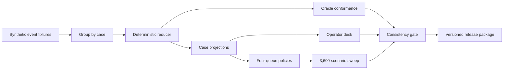

# x402 payment exception desk

[](https://github.com/RahilBhavan/coinbase-finance-operations/actions/workflows/verify.yml)
[](LICENSE)
**Live operator report: https://rahilbhavan.github.io/coinbase-finance-operations/**

A synthetic settlement-to-delivery exception desk for x402 payments on Base.

## The answer

When payment evidence and delivery evidence disagree, which case should an operator handle first, and what evidence makes a retry, recovery, refund, or closure safe? The desk replays 65 synthetic events across 16 incidents through one deterministic reducer, then runs the 9 actionable cases through four queue policies on the same workload.

| Policy | Overdue cases | Median delay (min) | p95 delay (min) | Value-weighted overdue (USDC-minutes) | Control failures |
|---|---|---|---|---|---|
| FIFO (baseline) | 6 | 66.1 | 107.1 | 4,428.9 | 0 |
| Deadline-first (proposed) | 6 | 55.1 | 107.1 | 1,582.2 | 0 |
| Value-first | 4 | 47.1 | 137.1 | 1,371.9 | 0 |
| Hybrid (SLA window, then value) | 4 | 77.1 | 127.1 | 982.1 | 0 |

FIFO stays. The proposed replacement, deadline-first, had to cut overdue cases by at least 15% with zero control failures, a gate set before the run. It cut value-weighted overdue time by 64% but left the same 6 cases overdue, so it failed the gate. Value-first and hybrid cut overdue cases to 4, but they were added after the gate was set, have not run on a held-out workload, and have a worse p95 delay than FIFO.

A 3,600-scenario sweep (100 seeds x 1 to 3 operators x 0.5x/1x/2x handling time x evidence delay x finality delay) shows that no policy wins every objective. Share of scenarios where each policy had the best result:

| Objective | FIFO | Deadline-first | Value-first | Hybrid |
|---|---|---|---|---|
| Fewest overdue cases | 9.7% | 20.8% | **51.7%** | 17.8% |
| Least value-weighted overdue time | 7.4% | 22.0% | 30.1% | **40.5%** |
| Lowest p95 delay | **50.0%** | 11.1% | 17.6% | 21.3% |

Ties split the credit. Control failures tie at 25% each because the seeded failures belong to the workload, not to the queue order. The queue rule should follow from the objective a team picks, not the other way around.

The state model keeps four facts apart: a timeout means the outcome is unknown, not failed, so it never triggers a new charge; chain evidence shows payment, not delivery; a refund approval reserves balance but is not a settled refund; and one piece of payment evidence cannot pay for two orders.

## How it's built



The event log is the evidence boundary. An append-only SQLite store holds the events, and every projection, reconciliation row, operator view, and policy result derives from them. A separately written oracle states the expected outcome of all 16 incidents, and the reducer matches it 16 of 16. A 26-check consistency gate ties every generated file to one run ID and to the fixture, oracle, and workload hashes. The code uses only the Python standard library.

## What's in it

- [Operator report](https://rahilbhavan.github.io/coinbase-finance-operations/): each case's evidence timeline, payment, delivery, and refund state, the allowed and forbidden next actions, and the policy comparison. Source: [`artifacts/generated/operator-report.html`](artifacts/generated/operator-report.html).
- [Decision memo (PDF)](artifacts/operations-memo.pdf): the policy decision, the evidence, and the strongest argument against FIFO.
- [Reconciliation workbook (XLSX)](artifacts/reconciliation.xlsx): cases, formulas, and the four-policy results.
- [Release package (ZIP)](outputs/coinbase-finance-operations-package.zip), with its [SHA-256 checksum](outputs/coinbase-finance-operations-package.zip.sha256): code, data, docs, and artifacts in one deterministic archive.
- [Demo video](artifacts/demo.mp4), [state model](artifacts/state-model.md), [operator runbook](artifacts/operator-runbook.md), and [validation report](artifacts/validation-report.md).

## Run it

Python 3.9 or later, no third-party packages.

```sh
git clone https://github.com/RahilBhavan/coinbase-finance-operations.git
cd coinbase-finance-operations
python3 scripts/release.py
```

`release.py` runs the tests, regenerates `artifacts/generated/`, runs the consistency gate, checks the memo, workbook, and video against their recorded hashes, and rebuilds the ZIP and checksum. It prints `"status": "PASS"` on success. CI runs the same command on Python 3.9 and 3.11.

The individual steps:

```sh
PYTHONPATH=src python3 -m unittest discover -s tests -v   # tests
PYTHONPATH=src python3 -m exception_desk.cli --root .     # regenerate outputs
open artifacts/generated/operator-report.html             # view the report locally
```

The release checks the memo, workbook, and video but does not rebuild them. Rebuilding them needs extra tools: `work/build_memo.py` needs `reportlab`, `work/build_demo.py` needs `Pillow` and `imageio-ffmpeg`, and `work/build_workbook.mjs` needs `@oai/artifact-tool`, a private Node runtime that is not publicly available. The committed files are the reference copies.

## Scope and limits

- All data is synthetic: incidents, amounts, identities, handling times, arrival rates, and every result.
- No live payments. The desk uses no wallet, signs nothing, calls no facilitator, and sends no transactions. Payment shapes follow the public x402 v2 specification and Base finality documentation.
- Handling times are model inputs, not measurements, so the policy results show tradeoffs, not a production recommendation.
- No payments practitioner has reviewed the workflow yet. The [operator task protocol](artifacts/operator-task-protocol.md) describes that review.
- This is an independent project. It is not affiliated with or endorsed by Coinbase and does not describe any Coinbase system or process.

## Project documents

- [Decision brief](01-brief/decision.md) and adoption gate
- [Source register](02-research/source-register.md) and [data feasibility](02-research/data-feasibility.md)
- [Design alternatives](03-design/alternatives.md) and [system design](03-design/system-design.md)
- [Artifact plan](04-deliverables/artifact-plan.md) and [reviewer packet](artifacts/reviewer-packet.md)
- [Release readiness](05-validation/release-readiness.md), [adversarial review](05-validation/adversarial-review.md), and [verification plan](05-validation/verification-plan.md)
- [Complete project guide](outputs/complete-project-guide.md)

## License

[MIT](LICENSE).
