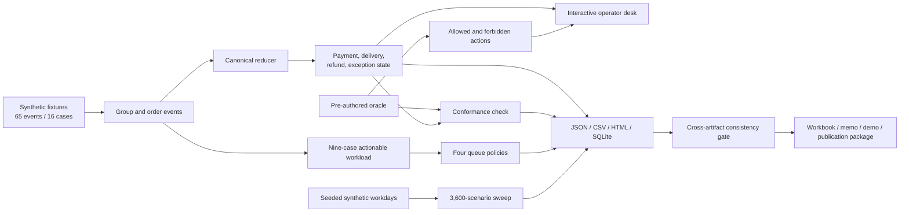
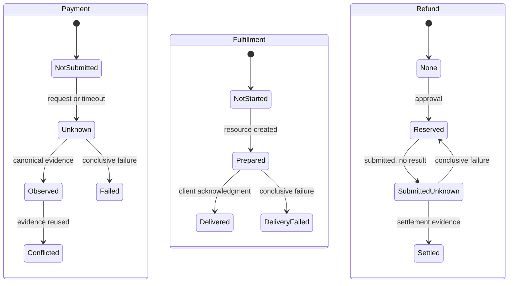
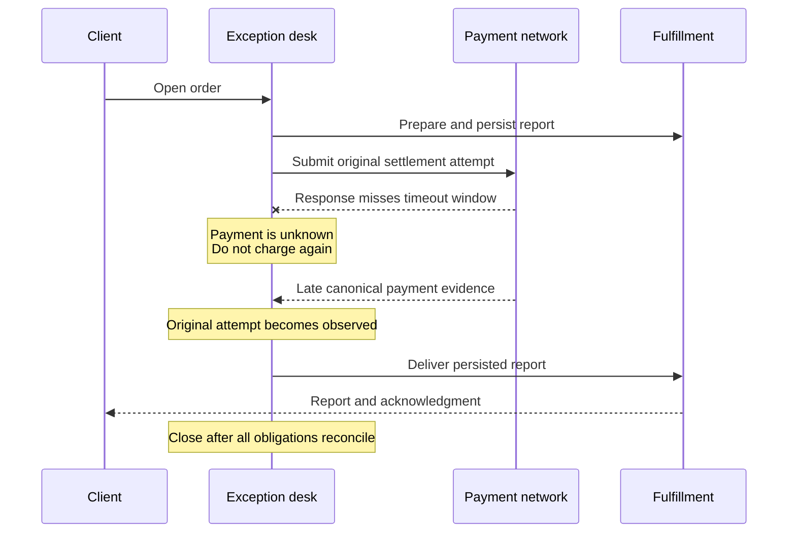
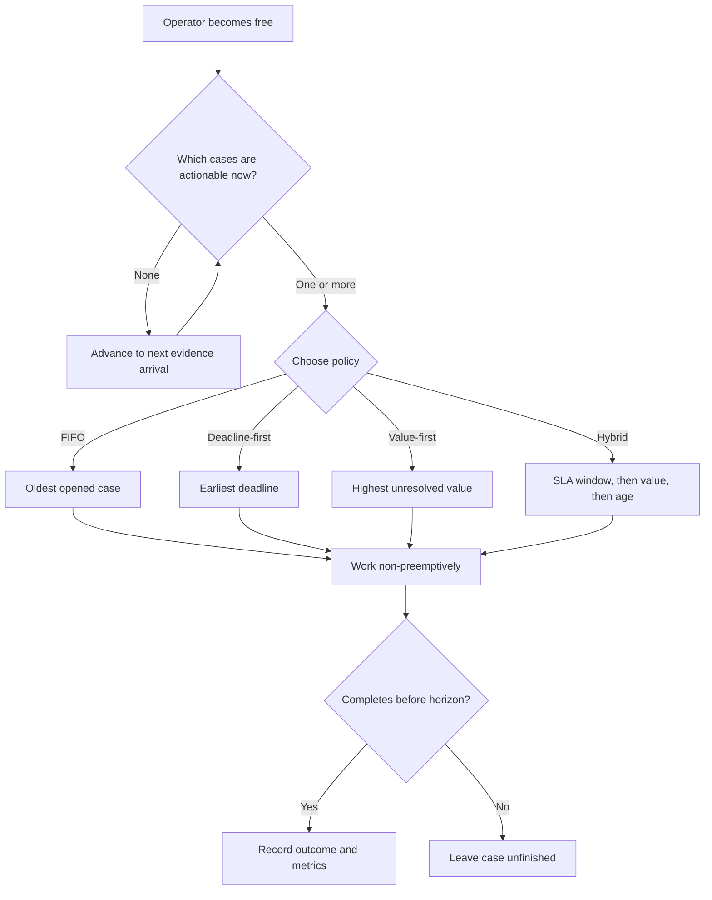
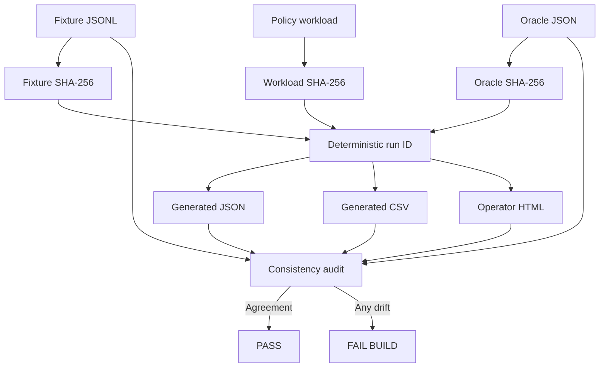
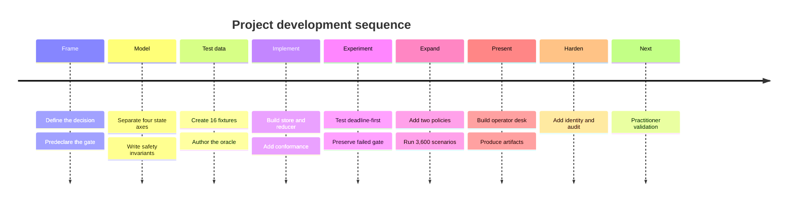

# Complete project guide: settlement-to-delivery exception desk

## What this project is

This is a local, synthetic model of a payments-operations problem:

> What should an operator do when payment, service-delivery, and refund evidence do not line up cleanly?

The motivating example is a payment request that times out. A timeout says the requesting system stopped waiting. It does not prove the payment failed. The payment may settle later. Charging again could therefore create a duplicate charge. If payment settles but the purchased report is not delivered, the obligation is different: recover delivery or refund the original payment without collecting again.

The project turns those ambiguities into an inspectable workflow containing:

- 65 synthetic events grouped into 16 cases;
- a separately authored expected-results file called the oracle;
- one deterministic reducer that derives state from events;
- controls for duplicate charges, reused evidence, delivery, and refunds;
- four operator-queue policies;
- a 3,600-scenario sensitivity experiment;
- an interactive local operator desk;
- JSON, CSV, SQLite, workbook, PDF, video, and reviewer artifacts;
- 51 automated tests and a cross-artifact consistency audit.

It is an analytical prototype and portfolio project. It is not a live Coinbase system and uses no wallet, customer data, real transaction, production service, or Coinbase internal process.

## The nine ideas to remember

1. The fixture says what happened.
2. The reducer reconstructs what is currently known.
3. The oracle checks whether that reconstruction matches the intended result.
4. Payment, delivery, refunds, and exceptions are separate state tracks.
5. A timeout is unknown, not failed.
6. Safety rules determine what an operator may do.
7. Queue policy determines which already-actionable case is handled next.
8. One run identity and consistency gate keep generated evidence aligned.
9. Every public claim remains bounded by “synthetic, local, and not production validation.”

## The complete flow



## Core concepts

### Why the states must remain separate



One track does not automatically advance another. An observed payment does not mark delivery complete, and a submitted refund does not release its reservation.

### Event and fixture

An event is an immutable statement that something was observed: an order opened, authorization verified, report prepared, settlement timed out, payment later appeared, delivery failed, or a refund was reserved. A fixture is one synthetic incident containing a sequence of events.

The authoritative event corpus is `data/incidents-v1.jsonl`. Events are grouped by `fixture_id` and ordered primarily by `observed_at`, because an operator must act on when evidence became available, not on facts the system had not yet observed.

### Oracle

`data/incidents-v1.oracle.json` is the separately authored answer key. For each fixture it records expected payment and fulfillment state, exception type, actionability, permissible and forbidden actions, closure evidence, and financial totals.

The oracle is not reducer input and does not calculate itself from the code. That separation makes the implementation falsifiable.

### Reducer and projection

A reducer is a deterministic function that converts an ordered history of events into current state. `reduce_events()` in `src/exception_desk/reducer.py` is the canonical owner of business state. It builds orders, payment attempts, chain observations, fulfillments, refunds, exceptions, evidence claims, and the applied-event history.

`project_case()` summarizes that detailed state into the terminal business answer used by conformance: payment state, fulfillment state, exception type, actionability, and financial totals.

### Four independent state axes

| Axis | Examples | Why separate it? |
|---|---|---|
| Payment | not submitted, unknown, failed, observed, conflicted | Payment can settle while delivery remains unresolved. |
| Fulfillment | not started, prepared, pending, delivered, failed | Chain evidence cannot prove the customer received the product. |
| Refund | reserved, submitted unknown, settled, failed/released | An unresolved refund still consumes refundable balance. |
| Exception | monitoring, actionable, closed | Financial state and required operator action are different questions. |

The main claim boundary is: **chain evidence does not prove delivery**.

### Idempotency and evidence ownership

Replaying the same event ID with the same content has no additional effect. Reusing an event ID with different content is corruption. A chain payment claim is identified by network, transaction reference, and log index; it cannot satisfy two orders.

### Refund reservation

Submitting a refund does not mean it settled. While its outcome is unknown, the amount remains reserved. Completed refunds plus active reservations cannot exceed the captured amount.

## How one build runs

The entry point is `build()` in `src/exception_desk/cli.py`.

1. It loads the fixture JSONL and oracle JSON.
2. It groups the events into 16 cases.
3. It recreates an append-only SQLite event database.
4. It reduces each fixture into canonical state.
5. It compares all 16 compact projections with the oracle.
6. It turns the nine actionable fixtures into a queue workload.
7. It runs FIFO, deadline-first, value-first, and hybrid policies on identical inputs.
8. It runs the 3,600-scenario sensitivity experiment.
9. It hashes the fixture, oracle, and policy workload and derives a stable run ID.
10. It writes JSON, CSV, SQLite, HTML, CSS, and JavaScript outputs.
11. It runs the independent consistency audit.
12. It fails if the generated artifacts disagree.

The reproducible command is:

```sh
PYTHONPATH=src python3 -m exception_desk.cli --root .
```

### Important SQLite nuance

The build writes normalized events to `artifacts/generated/exception-desk.sqlite`, but it currently calculates projections directly from the in-memory fixture events. It does not read the SQLite records back into the reducer. SQLite is therefore an inspectable persistence artifact and independently tested component, not the current projection replay source.

## Worked example: timeout followed by late success

The fixture `ex-03-timeout-late-success` demonstrates the core safety rule.

1. An order opens for 30,000,000 atomic units.
2. Its authorization verifies.
3. The purchased report is prepared and persisted.
4. The settlement request times out.
5. The reducer records `timed_out=True`, but keeps the payment outcome unknown.
6. Later, canonical matching payment evidence appears for the original attempt.
7. That same attempt becomes observed; no replacement attempt is created.
8. The report is still prepared but not acknowledged as delivered.
9. The final exception becomes `delivery_pending_after_late_settlement`.

Allowed actions are delivering the persisted report and reconciling the original attempt. Charging again and creating a second entitlement are forbidden. Closure requires canonical payment evidence, a matching resource digest, and client delivery acknowledgment.

The lesson is that the timeout described observation latency, not payment truth.



## Queue-policy analysis



The simulator in `src/exception_desk/policy.py` is deterministic and non-preemptive. An operator chooses a new case only when free. A case cannot be chosen before `actionable_at`, which prevents future-data leakage.

| Policy | Selection rule |
|---|---|
| FIFO | Oldest opened case first. |
| Deadline-first | Earliest deadline first. |
| Value-first | Highest unresolved amount first. |
| Hybrid | Cases inside the SLA window first, then highest value, then oldest. |

Each policy receives a deep copy of the same normalized workload. A SHA-256 workload fingerprint proves the inputs match.

The metrics are overdue count, median and p95 resolution delay, value-weighted overdue minutes, unfinished count and value, touches, and control failures. Value-weighted overdue minutes is a prioritization metric, not money lost.

### Initial nine-case result

| Policy | Overdue | Median delay | p95 delay | Value-weighted overdue minutes |
|---|---:|---:|---:|---:|
| FIFO | 6 | 66.05 | 107.05 | 4,428,900,000.12 |
| Deadline-first | 6 | 55.05 | 107.05 | 1,582,200,000.11 |
| Value-first | 4 | 47.05 | 137.05 | 1,371,900,000.06 |
| Hybrid | 4 | 77.05 | 127.05 | 982,100,000.06 |

The original proposal was deadline-first. Its predeclared gate required at least 15% fewer overdue cases than FIFO. Both produced six, so the proposal failed its own gate. Retaining FIFO for that comparison was the disciplined result.

### The 3,600-scenario sweep

`src/exception_desk/experiments.py` generates deterministic 40-case synthetic days across:

- 100 seeds;
- 1, 2, or 3 operators;
- 0.5×, 1×, or 2× handling duration;
- zero or 15 minutes of evidence delay;
- zero or 10 minutes of finality delay.

That is `100 × 3 × 3 × 2 × 2 = 3,600` scenarios.

The explicit base handling-time assumptions are 12 minutes for evidence mismatch, 20 for timeout reconciliation, 8 for delivery recovery, and 30 for refund investigation. These are model inputs, not measurements.

Across the sweep:

- value-first most often minimized overdue count: 51.6% win rate;
- hybrid most often minimized value-weighted overdue time: 39.9%;
- FIFO most often minimized p95 delay: 44.3%;
- total control failures tied because the seeded failures belong to the workload, not the queue order.

Tied policies split one unit of scenario win credit. A win rate means “fractional share of scenarios with the minimum synthetic metric,” not the probability of real-world success.

The real discovery is that no policy wins every objective. The objective must be declared before choosing the queue rule.

## Operator interface

`src/exception_desk/export.py` creates the local HTML report. It contains all 16 cases, independent state cards, evidence timelines, evidence gaps, allowed and forbidden actions, and run-level traceability. User-provided content is escaped at the HTML boundary.

`web/operator-report.js` only controls case navigation, actionable/blocked filters, and the simulated unsafe-recharge refusal. It performs no network request or payment action. The recharge button changes local text to a refusal and disables itself.

The report includes keyboard focus, semantic controls, ARIA live regions, reduced-motion behavior, responsive styling, and a print/static fallback.

Two nuances matter:

- The allowed/forbidden action lists currently come from the oracle after the reducer state is calculated; they are not inferred by an independent production authorization engine.
- The HTML policy table still shows FIFO versus deadline-first, while the JSON, CSV, and workbook contain all four policies.

## Generated evidence and the consistency gate

The current run ID is `run-a6cf865a0efd58de`.

Important generated files include:

| File | Meaning |
|---|---|
| `build-summary.json` | Run ID, hashes, counts, input paths, and build status |
| `projections.json` | Full reducer state for every case |
| `oracle-conformance.json` | Reducer result versus oracle for every case |
| `policy-results.json/.csv` | Four-policy result on the initial actionable workload |
| `scenario-sweep-summary.json` | Metric distributions and win rates over 3,600 scenarios |
| `exception-desk.sqlite` | Append-only normalized event records |
| `operator-report.html` | Interactive local case desk |
| `consistency-audit.json` | Result of 23 cross-artifact checks |

`src/exception_desk/consistency.py` verifies source hashes, shared identities, labels, counts, policy CSV/JSON agreement, workload fingerprints, and the visible claim boundary. This prevents a chart, JSON file, and HTML report from silently describing different builds.

The generated `reconciliation.csv` is populated from the oracle's expected financials. It is an expected reconciliation export, not an independently calculated transaction ledger. Reducer-calculated amounts are proven through oracle conformance.

The consistency gate currently covers authoritative inputs and generated JSON, CSV, and HTML. It does not cryptographically bind the PDF, workbook, video, or ZIP.



## Tests

The 51 tests cover:

- fixture shape, uniqueness, ordering, and synthetic labels;
- reducer transitions, timeout recovery, evidence conflicts, and refund limits;
- append-only storage and replay;
- all 16 oracle comparisons;
- deterministic scheduling, four policies, multiple operators, and future-data isolation;
- seeded experiment generation and win-rate accounting;
- HTML escaping, accessibility structure, filters, and recharge refusal;
- full temporary-project builds;
- deliberate artifact drift detection.

Tests prove the implemented behavior for the declared synthetic corpus. They do not prove production readiness.

## What each human-facing artifact is for

| Artifact | Purpose |
|---|---|
| `operations-memo.pdf` | Short executive decision and limits |
| `state-model.md` | Precise payment, delivery, refund, and exception semantics |
| `operator-runbook.md` | Evidence, ownership, safe actions, and closure rules |
| `reconciliation.xlsx` | Reviewable cases, formulas, and four-policy results |
| `operator-report.html` | Interactive case-by-case inspection |
| `demo.mp4` | Three-minute narrated walkthrough |
| `validation-report.md` | Tests, results, and unproven claims |
| `operator-task-protocol.md` | Repeatable external practitioner review that has not yet run |
| `reviewer-packet.md` | Suggested review order and questions |
| `source-register.csv` | Source provenance and limitations |
| `publication-plan.md` | Website article, X Article/thread, assets, SEO, and launch plan |
| `daily-build-log.md` | Evidence-backed record of major changes |
| Portfolio ZIP | Portable package of the project |

## How the project was developed

1. **Frame the decision.** The work began with a narrow operating choice and a predeclared adoption gate.
2. **Define state and safety.** Payment, delivery, refunds, and exceptions were separated; timeout, evidence ownership, and refund invariants were written down.
3. **Author fixtures and oracle.** Sixteen synthetic incidents and their independently stored expected outcomes created a falsifiable target.
4. **Build persistence and reduction.** An append-only SQLite store and deterministic reducer reconstructed state.
5. **Test a policy proposal.** Deadline-first failed its primary gate against FIFO.
6. **Expand the design space.** Value-first, hybrid, multi-operator capacity, and 3,600 sensitivity scenarios exposed objective tradeoffs.
7. **Improve operator review.** The static report became an accessible, navigable, safe local desk.
8. **Harden artifact integrity.** Shared hashes, run identity, and a consistency gate made output drift detectable.
9. **Package the story.** Memo, workbook, demo, runbook, validation, daily log, and publication plan explain the same evidence to different audiences.
10. **Define honest external validation.** A three-practitioner task protocol was written but has not been claimed as completed.



## What is proven

- All 16 synthetic cases match their pre-authored expected states.
- Timeout remains distinct from failure.
- Late success updates the original attempt without creating a new charge.
- Payment and delivery remain separate.
- Reused payment evidence creates a conflict.
- Refund reservations protect captured value in the tested cases.
- All four policies receive identical inputs.
- Future evidence cannot influence current scheduling.
- The seeded sweep is deterministic.
- The local recharge control always refuses.
- Generated machine-readable artifacts agree.
- The 51 tests pass for the implemented rules.

## What is not proven

- Real incident frequency or handling-time realism.
- Live x402, wallet, facilitator, or Base interoperability.
- Production security, performance, availability, or legal sufficiency.
- Coinbase's actual internal workflow.
- Customer outcomes, savings, staffing improvements, or production risk reduction.
- A universal best queue policy.
- Practitioner usability or accessibility validated with real users.
- That SQLite was replayed to produce the current projections.
- That action authorization comes from an independent production rules system.

## Known gotchas and documentation drift

- Some older planning documents describe artifacts as future work or call deadline-first the selected design. Current source code, generated outputs, the manifest, and validation report are more authoritative.
- `project_case()` returns fields beginning with `expected_` even though they are actual reducer outputs shaped to compare with the oracle.
- The reducer directly accepts fixture events, but the legacy `reducer_events()` adapter remains in the SQLite path.
- The reducer trusts explicit mismatch events for some contract-mismatch scenarios rather than independently comparing every observation field to the order.
- Captured value sums canonical observation records; a production design would need stronger same-order claim deduplication.
- Atomic amounts are raw integers with no currency conversion.
- The simulation horizon leaves work unfinished if it cannot complete before the horizon, which may differ from a real shift-handoff process.
- Automated accessibility structure is not the same as a user accessibility study.

## Recommended reading order

1. This guide.
2. `outputs/operations-memo.pdf` for the executive result.
3. `artifacts/state-model.md` for the core mental model.
4. `artifacts/generated/operator-report.html`, focusing on `ex-03-timeout-late-success`.
5. `artifacts/operator-runbook.md` for safe operating decisions.
6. `outputs/reconciliation.xlsx` and generated policy results.
7. `artifacts/validation-report.md` for what is and is not verified.
8. `artifacts/operator-task-protocol.md` for the missing external-review step.
9. Source code in this order: `cli.py`, `reducer.py`, `policy.py`, `experiments.py`, `export.py`, `consistency.py`.

## Compact glossary

| Term | Plain-English meaning |
|---|---|
| Actionable | Enough evidence exists for a safe operator decision. |
| Atomic amount | Integer value in the asset's smallest modeled unit. |
| Canonical evidence | Evidence accepted as part of the valid modeled chain history. |
| Capture | Payment recognized as observed under the model. |
| Closure evidence | Facts required before safely closing a case. |
| Entitlement | The customer's right to receive the purchased resource. |
| Event | Immutable record of something observed. |
| Finality delay | Modeled delay before sufficiently trusted payment evidence appears. |
| Fixture | One synthetic incident case. |
| Idempotency | Repeating the same valid input has no additional effect. |
| Oracle | Separately authored expected answer used to test the reducer. |
| Projection | Current state calculated from the event history. |
| Reducer | Deterministic function that converts events into state. |
| Reservation | Refund amount held aside so it cannot be promised twice. |
| SLA | Deadline or service-level target used for prioritization. |
| Timeout | The caller stopped waiting; the underlying outcome remains unknown. |
| Workload fingerprint | Hash proving policies received identical case inputs. |

## One-sentence mental model

This project takes an immutable synthetic evidence history, separates payment from delivery and refunds, tests safe decisions against prewritten expectations, compares queue rules on identical workloads, and packages every claim with reproducible evidence and explicit limitations.
